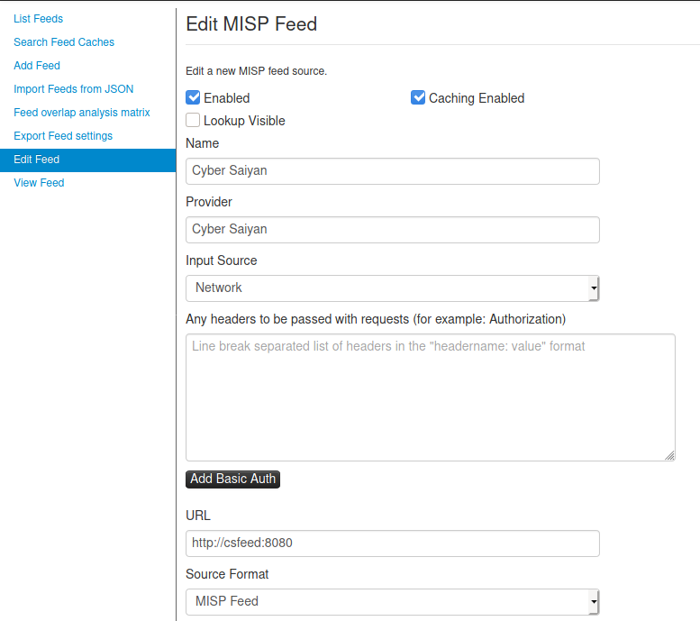

# Cybersaiyan Info-Sharing - TAXII to MISP

Questo script consente di importare i contenuti del feed TAXII di Cyber Saiyan nella piattaforma MISP.

Lo script:
    - Effettua il POLL dei contenuti dal server TAXII di Cyber Saiyan
    - Riorganizza i contenuti in forma di evento MISP, effettuando il pivoting sulla descrizione dello STIX Package e sull'autore dello stesso
    - Crea in memoria un feed MISP con i contenuti riorganizzati
    - Serve tale feed MISP mediante HTTP, utilizzando Flask e simulando la Index di un server HTTP


## Avvio dello script
### virtualenv
- Creare un Virtualenv con Python 3
    ```
    virtualenv cs-to-misp || python3 -m venv cs-to-misp
    . cs-to-misp/bin/activate
    ```
- Installare le dipendenze all'interno del Virtualenv
    ```
    pip install -r requirements.txt
    ```
- Eseguire lo script, che rimarrà - per configurazione predefinita - in ascolto su tutte le interfacce di rete alla porta 8080

### Docker
- Effettuare la build dell'immagine Docker utilizzando il Dockerfile fornito
    ```
    docker build -t cs-to-misp .
    ```
- Eseguire il container mappando eventualmente la porta 8080 in locale o su un indirizzo a piacere (si veda documentazione di Docker
    ```
    docker run cs-to-misp
    ```
    oppure
    ```
    docker run cs-to-misp -p d$8080:127.0.0.1:8080
    ```

### Configurazione dello script
Lo script può essere configurato tramite variabili di ambiente (comode anche nello usecase Docker), tutte opzionali, in particolare:
* `LISTEN_ADDRESS` rappresenta l'indirizzo su cui lo script rimarrà in ascolto (default `0.0.0.0`)
* `LISTEN_PORT` rappresenta la porta su cui lo script rimarrà in ascolto (default `8080`)
* `SCHEDULED_INTERVAL` rappresenta l'intervallo temporale con cui verrà fatta l'operazione di polling, in secondi (default: `30*60`, ovvero 30 minuti)
* `CYBERSAIYAN_FEED_URL` contiene l'indirizzo del server TAXII di CyberSaiyan (default `infosharing.cybersaiyan.it`)
* `CYBERSAIYAN_COLLECTION_NAME` contiene il nome della collection TAXII (default `CS-COMMUNITY-TAXII`)

### Configurazione MISP

Su MISP occorre creare la definizione di un nuovo feed specificando come URL l'indirizzo su cui il server web dello script risponde come da screenshot sottostante:



